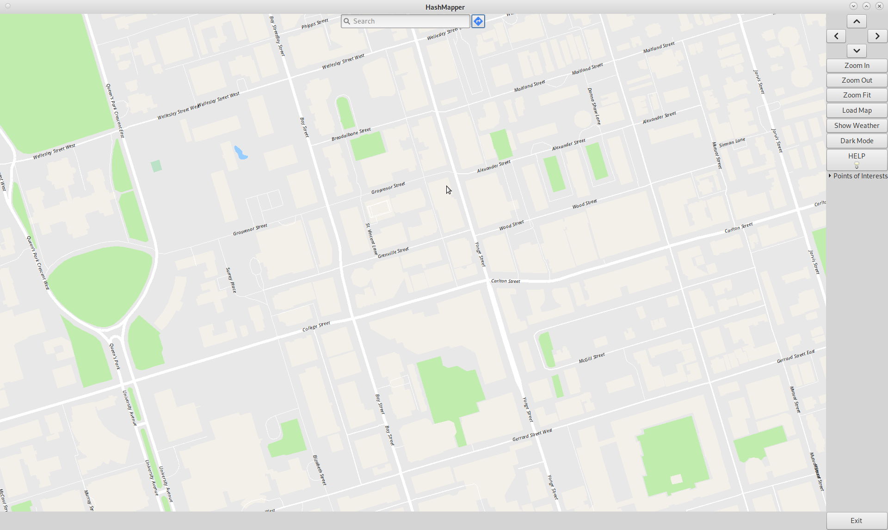
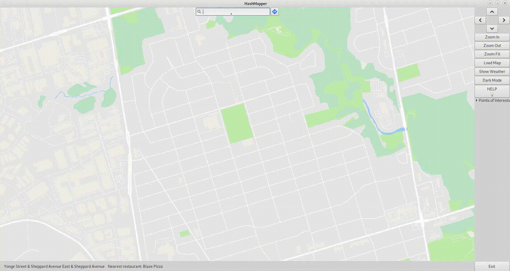
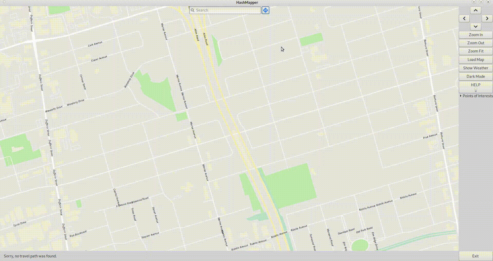
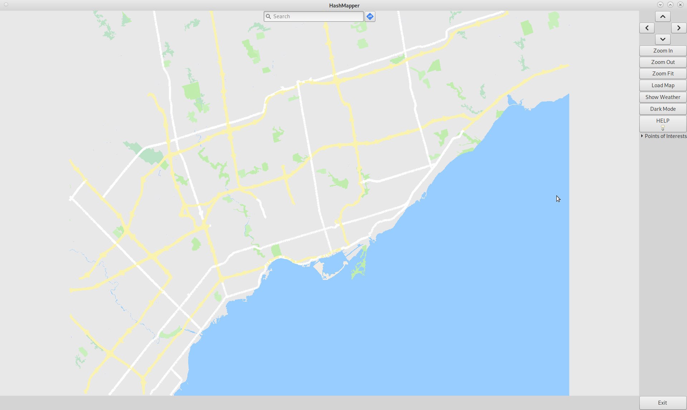
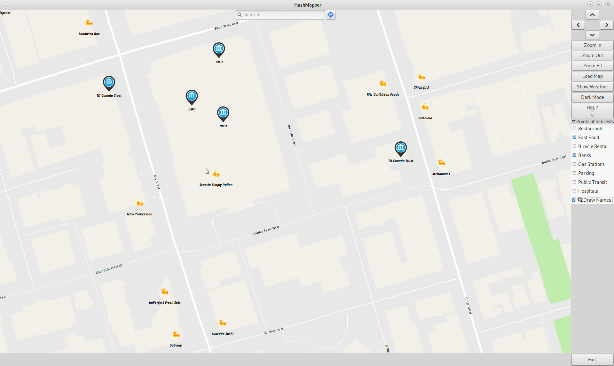
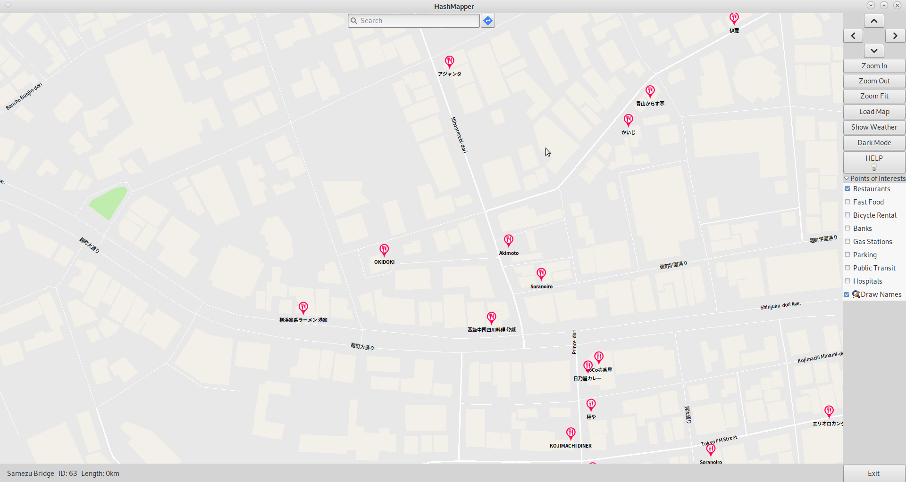
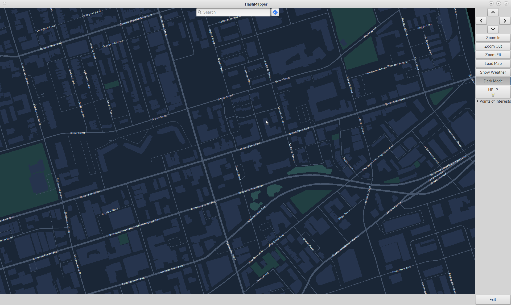
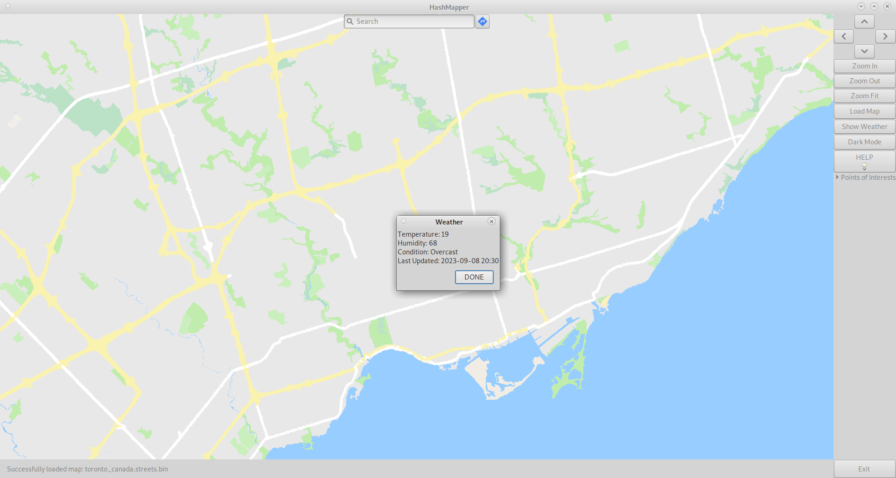

# Hashmapper
### Course: ECE297
### Developers: Kenny Cui, Eric Chen, Justin Pang

##### Hashmapper is a mapping software created by a team of three Computer Engineering students. All code was developed in C++ and heavily utilized the C++ Standard Library (STL). Map data is obtained from an OpenStreetMap API provided by the course. 

##### Note: This repository is only meant to be a showcase of hashmapper, it does not contain any code because we are disallowed from posting it since ECE297 uses the same project every year. For future ECE297 students, feel free to take inspiration from our design choices and features!

# Features

## Main Features

### Searchbar & Autocomplete

##### The main searchbar at the top is used to search streets or intersections. The search system shows autocompleted results for partial string inputs. After hitting enter, the map instantly rezooms to show the desired street/intersection.

##### This feature was implemented by storing street name prefixes (the first three characters of the street name) in a std::map. Up to 7 results are shown for partial searches that match with the prefixes in the std::map. This efficient structure enabled updated autocomplete results after every additional letter typed.

##### The software uses the '&' character to distinguish between searching intersections vs streets

|  | Search format | Example |
| -------- | -------- | -------- |
| Street | "<STREET_NAME\>" | "College Street" |
| Intersection | "<STREET_NAME_1> & <STREET_NAME_2>" | "Bay & Yonge" |

### Directions Mode

### Zoom/Detail Level

### Points of Interests Menu

## Extra Features
### Dark Mode

### Local Weather

